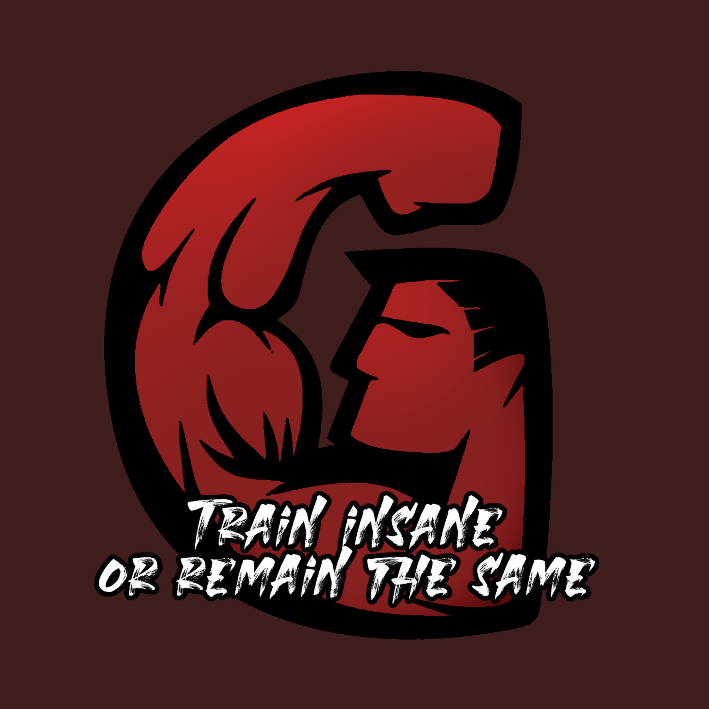
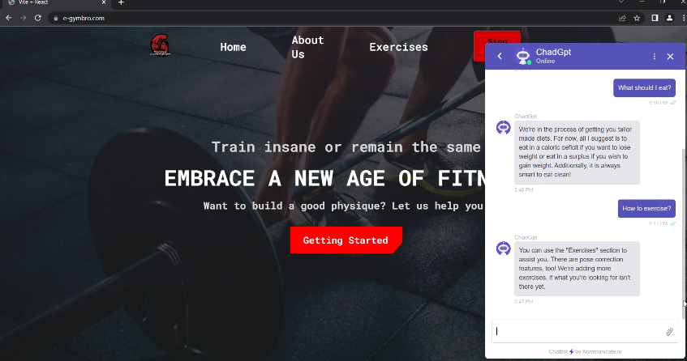
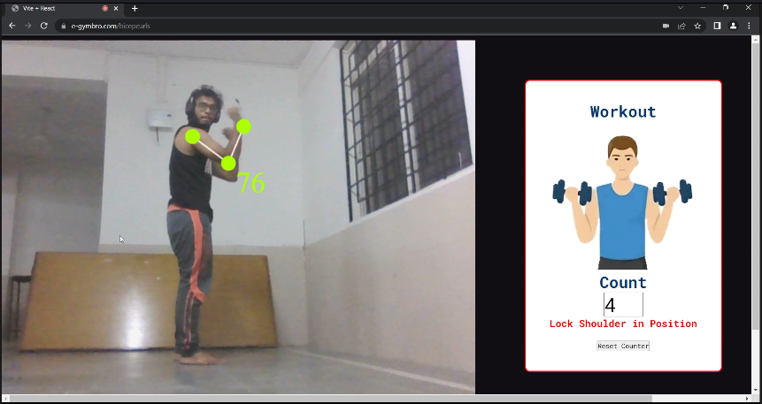
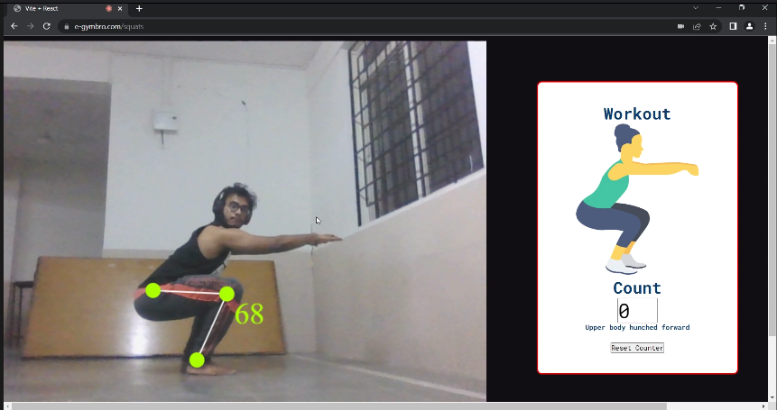
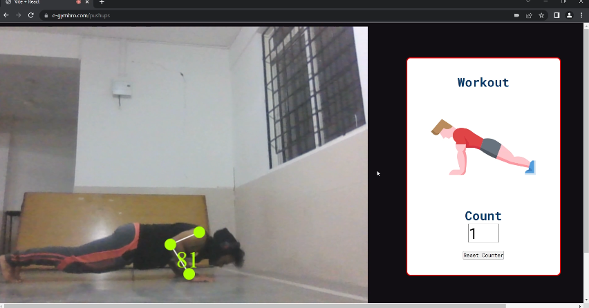
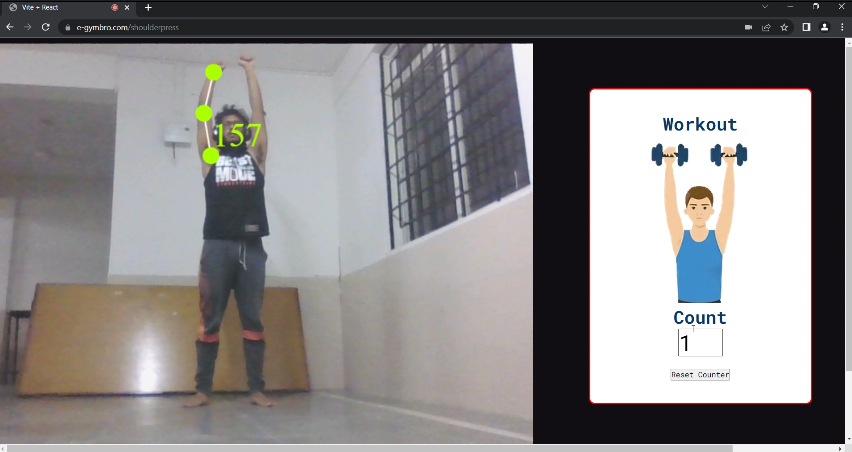

# e-GymBro

### Overview

e-GymBro is a web based application that aims to provide its users with a virtual “gym bro,” a non-judgmental and free-of-cost fitness partner and mentor right at home. It helps the user in keeping track of their progress as they exercise and provides them with feedback to improve their form. It also provides the user with their very own fitness assistant called ChadGPT.

### Problem statement

Many people in this world find themselves located nowhere near a gym, are unable to find a gym trainer or cannot afford either or both. Starting a fitness journey can thus be very daunting, especially because of the risk of injury when executing exercises with improper form due to lack of supervision. This causes a lot of beginners to never start on improving their health.

### Details

The web app is hosted on a Google Compute Engine which is an N2D AMD instance running an Nginx server. The frontend makes use of React with Vite, and the MediaPipe library is used for tracking the movement of the user during exercise. The fitness assistant is a chatbot powered by Google DialogFlow. The server files are stored in a Google Cloud Bucket, and the domain name is registered using Cloud Domains alongside Cloud DNS, allowing for the web app to be easily accessible to anyone over the internet. In order to ensure that all traffic on the server is encrypted and thereby preserve the privacy of its users, Let’s Encrypt has been used to create a digital certificate enabling HTTPS.

### Results

### Future Plans

We plan to upscale our product by adding a personalized diet and training system along with a fitness progress tracker. Immediately next in the pipeline, we have a machine learning based bodyfat prediction system that allows you to find out your bodyfat percentage without having to resort to the laborious tradition means of testing. Instead, the user only needs to plug in their age, height, weight and some other body measurements that can easily be taken at home.

### Contributors:

Team Name: Goal Diggers

- [Anay Pareek](https://github.com/anay-p)
- [Ashutosh Rath](https://github.com/Lucif3r-in)
- [Omkar Amlan Krishna](https://github.com/OmkarAmlan)
- [Shirsho Das Roy](https://github.com/shirsho-roy)
